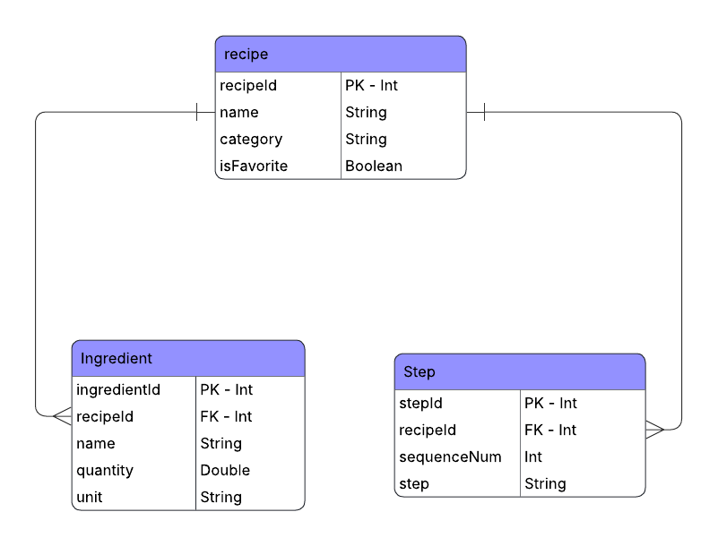
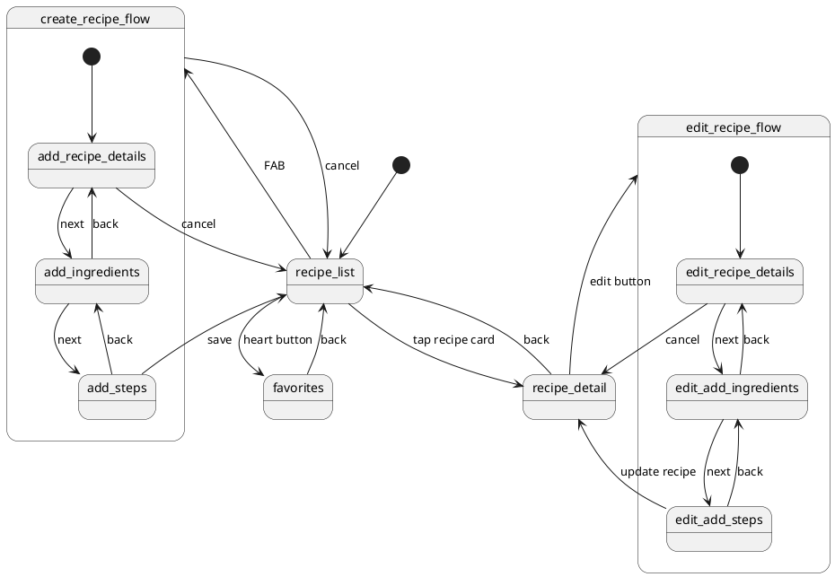
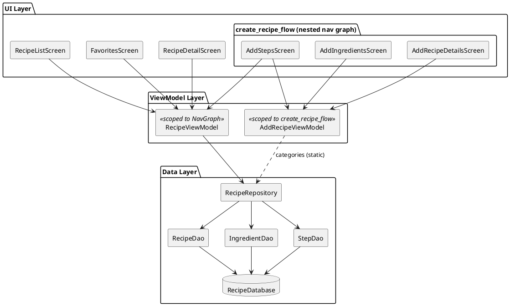

# Recipe App

## Data Model

### Entity Relationship Diagram

### Database Schema

**recipe**

| Column | Type | Constraints |
|---|---|---|
| `recipeId` | INTEGER | Primary Key, Auto-generated |
| `name` | TEXT | Not Null |
| `category` | TEXT | Not Null |
| `isFavorite` | INTEGER (Boolean) | Not Null |

**Ingredient**

| Column | Type | Constraints |
|---|---|---|
| `ingredientId` | INTEGER | Primary Key, Auto-generated |
| `recipeId` | INTEGER | Foreign Key → `recipe.recipeId`, On Delete Cascade |
| `name` | TEXT | Not Null |
| `quantity` | REAL | Not Null |
| `unit` | TEXT | Not Null |

**Step**

| Column | Type | Constraints |
|---|---|---|
| `stepId` | INTEGER | Primary Key, Auto-generated |
| `recipeId` | INTEGER | Foreign Key → `recipe.recipeId`, On Delete Cascade |
| `sequenceNum` | INTEGER | Not Null |
| `step` | TEXT | Not Null |

---

## Navigation Graph

### Screens

| Screen | Function |
|---|---|
| `recipe_list` | Displays all recipes organized by category. Entry point for navigating to recipe detail, favorites, and the create recipe flow. |
| `favorites` | Displays all recipes marked as favorites. Navigated to by selecting the heart icon. |
| `recipe_detail` | Displays the full details of a selected recipe including ingredients and steps. |
| `add_recipe_details` | Step 1 of the create recipe flow. Collects the recipe name and category. |
| `add_ingredients` | Step 2 of the create recipe flow. Collects the ingredients with name, quantity, and unit. |
| `add_steps` | Step 3 of the create recipe flow. Collects the preparation steps in order. This is where the user saves their new recipe. |

# Note: All screens used to edit a saved recipe are reused screens from the add-recipe flow

---

## App Architecture

### Component Descriptions

| Component | Scope | Purpose |
|---|---|---|
| `RecipeListScreen` | UI | Displays all recipes; entry point for navigation to detail, favorites, and create flow |
| `FavoritesScreen` | UI | Displays recipes marked as favorite; allows toggling favorite off |
| `RecipeDetailScreen` | UI | Shows full details (ingredients and steps) of a selected recipe |
| `AddRecipeDetailsScreen` | UI | Step 1 of create flow — collects recipe name and category |
| `AddIngredientsScreen` | UI | Step 2 of create flow — collects ingredient name, quantity, and unit |
| `AddStepsScreen` | UI | Step 3 of create flow — collects cooking steps; submits the recipe |
| `RecipeViewModel` | Scoped to NavGraph | Shared across all screens; provides recipe/favorites streams and handles DB write operations |
| `AddRecipeViewModel` | Scoped to `create_recipe_flow` | Manages form state across the three create-recipe screens; cleared after submission |
| `RecipeRepository` | Data | Single source of truth for all data operations; abstracts DAOs from ViewModels |
| `RecipeDao` | Data | Room DAO for CRUD operations on the `recipe` table |
| `IngredientDao` | Data | Room DAO for CRUD operations on the `Ingredient` table |
| `StepDao` | Data | Room DAO for CRUD operations on the `Step` table |
| `RecipeDatabase` | Data | Room database; hosts all three tables and provides DAO instances |

---

## API Integration

The app integrates with [TheMealDB](https://www.themealdb.com/api.php) (free tier) to let users search for meals online and save them as local recipes.

### API Screens

| Screen | Function |
|---|---|
| `api_search` | Search by meal name, category, or ingredient. Displays results as a scrollable list of cards. |
| `api_meal_detail/{mealId}` | Shows full meal details fetched from the API: category, area, ingredients with measures, and numbered cooking steps. A FAB lets the user save the meal to the local database. |

### Network Layer

| Component | Purpose |
|---|---|
| `RetrofitClient` | Singleton Retrofit instance configured with base URL `https://www.themealdb.com/api/json/v1/1/` and a Gson converter. Includes an OkHttp logging interceptor for debug builds. |
| `MealApiService` | Retrofit service interface with suspend functions for `search.php` (by name), `filter.php` (by category/ingredient), and `lookup.php` (by ID). |
| `MealListResponse` | Wraps the `meals: List<MealDto>?` envelope returned by all API endpoints. |
| `MealDto` | Maps a full meal object from the API, including 20 ingredient/measure field pairs. Exposes a `getIngredients()` helper that zips non-empty ingredient names with their measures. |
| `MealRepository` | Interface that abstracts all API calls behind `Result`-returning suspend functions. |
| `MealRepositoryImpl` | Implements `MealRepository` using `runCatching` for uniform error handling. |

### API ViewModels

| ViewModel | Scope | Purpose |
|---|---|---|
| `ApiSearchViewModel` | `api_search` screen | Manages search query, `SearchType` (Name / Category / Ingredient), result list, loading, and error state. |
| `ApiMealDetailViewModel` | `api_meal_detail` screen | Fetches meal details by ID; handles converting and saving the API meal into local `Recipe`, `Ingredient`, and `Step` entities. |

### Saving an API Meal Locally

When the user taps **"Save Recipe"** on the the screen, `ApiMealDetailViewModel` converts the `MealDto` into local Room entities:

- A `Recipe` row is created from the meal name and category.
- Each non-empty ingredient/measure pair from `getIngredients()` becomes an `Ingredient` row.
- The raw instructions string is split on line breaks, blank lines and "Step N:" labels are stripped, and each remaining line becomes an ordered `Step` row.
