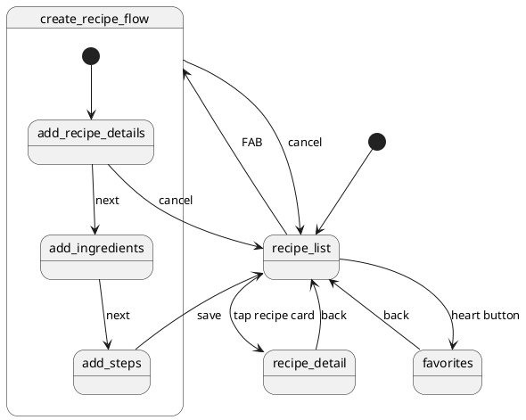

# Recipe App

## Navigation 

### Navigation 

### Screens

| Screen | Function |
|--------|----------|
| Recipe list | Displays all recipes organized by category. Entry point for navigating to recipe detail screen, favorites screen, and the create recipe flow. |
| Favorites | Displays all recipes marked as favorites. Navigated to by selecting heart icon.|
| Recipe detail | Displays the full details of a selected recipe including ingredients and steps. |
| Add recipe details | Step 1 of the create recipe flow. Collects the recipe name and category. |
| Add ingredients | Step 2 of the create recipe flow. Collects the ingredients with name, quantity, and unit. |
| Add steps | Step 3 of the create recipe flow. Collects the preparation steps in order. This is where the user is finally given the option to save their new recipe.|

## Data Model

### Entity Relationship Diagram

#### Recipe
| Column | Type | Key |
|--------|------|-----|
| recipeId | Int | PK |
| name | String | |
| category | String | |
| isFavorite | Boolean | |

#### Ingredient
| Column | Type | Key |
|--------|------|-----|
| ingredientId | Int | PK |
| recipeId | Int | FK |
| name | String | |
| quantity | Double | |
| unit | String | |

#### Step
| Column | Type | Key |
|--------|------|-----|
| stepId | Int | PK |
| recipeId | Int | FK |
| sequenceNum | Int | |
| step | String | |
