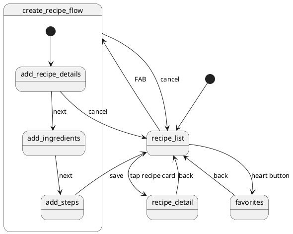
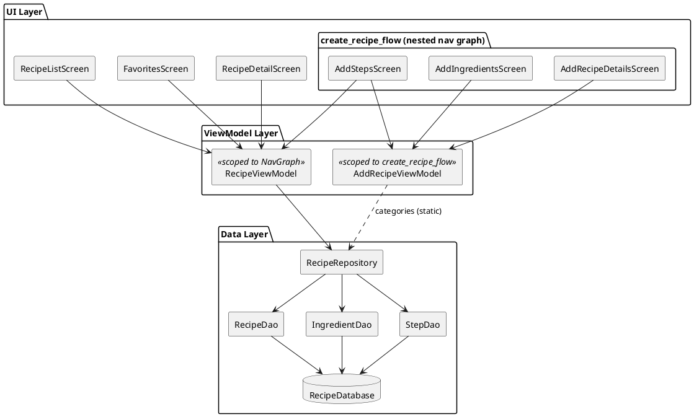

# Recipe App

## Data Model

### Entity Relationship Diagram

### Database Schema

**recipe**

| Column | Type | Constraints |
|---|---|---|
| `recipeId` | INTEGER | Primary Key, Auto-generated |
| `name` | TEXT | Not Null |
| `category` | TEXT | Not Null |
| `isFavorite` | INTEGER (Boolean) | Not Null |

**Ingredient**

| Column | Type | Constraints |
|---|---|---|
| `ingredientId` | INTEGER | Primary Key, Auto-generated |
| `recipeId` | INTEGER | Foreign Key → `recipe.recipeId`, On Delete Cascade |
| `name` | TEXT | Not Null |
| `quantity` | REAL | Not Null |
| `unit` | TEXT | Not Null |

**Step**

| Column | Type | Constraints |
|---|---|---|
| `stepId` | INTEGER | Primary Key, Auto-generated |
| `recipeId` | INTEGER | Foreign Key → `recipe.recipeId`, On Delete Cascade |
| `sequenceNum` | INTEGER | Not Null |
| `step` | TEXT | Not Null |

---

## Navigation Graph

### Screens

| Screen | Function |
|---|---|
| `recipe_list` | Home screen; displays all recipes grouped by category; navigate to favorites, recipe detail, or create flow |
| `favorites` | Displays recipes marked as favorite; tap to view details or toggle favorite off |
| `recipe_detail` | Shows full details of a selected recipe including ingredients and steps |
| `add_recipe_details` | Step 1 of create flow — enter recipe name and category |
| `add_ingredients` | Step 2 of create flow — add ingredients with name, quantity, and unit |
| `add_steps` | Step 3 of create flow — add cooking steps; submit saves the recipe |

---

## App Architecture

### Component Descriptions

| Component | Scope | Purpose |
|---|---|---|
| `RecipeListScreen` | UI | Displays all recipes; entry point for navigation to detail, favorites, and create flow |
| `FavoritesScreen` | UI | Displays recipes marked as favorite; allows toggling favorite off |
| `RecipeDetailScreen` | UI | Shows full details (ingredients and steps) of a selected recipe |
| `AddRecipeDetailsScreen` | UI | Step 1 of create flow — collects recipe name and category |
| `AddIngredientsScreen` | UI | Step 2 of create flow — collects ingredient name, quantity, and unit |
| `AddStepsScreen` | UI | Step 3 of create flow — collects cooking steps; submits the recipe |
| `RecipeViewModel` | Scoped to NavGraph | Shared across all screens; provides recipe/favorites streams and handles DB write operations |
| `AddRecipeViewModel` | Scoped to `create_recipe_flow` | Manages form state across the three create-recipe screens; cleared after submission |
| `RecipeRepository` | Data | Single source of truth for all data operations; abstracts DAOs from ViewModels |
| `RecipeDao` | Data | Room DAO for CRUD operations on the `recipe` table |
| `IngredientDao` | Data | Room DAO for CRUD operations on the `Ingredient` table |
| `StepDao` | Data | Room DAO for CRUD operations on the `Step` table |
| `RecipeDatabase` | Data | Room database; hosts all three tables and provides DAO instances |
