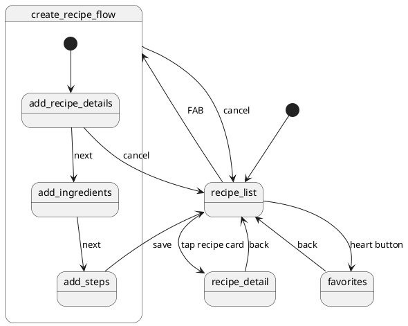

# Recipe App

## Navigation Graph

## Database Schema

## Screens

| Screen | Function |
|--------|----------|
| Recipe list | Displays all recipes organised by category. Entry point for navigating to recipe detail, favorites, and the create recipe flow. |
| Favorites | Displays all recipes marked as favorites. |
| Recipe detail | Displays the full details of a selected recipe including ingredients and steps. |
| Add recipe details | Step 1 of the create recipe flow. Collects the recipe name and category. |
| Add ingredients | Step 2 of the create recipe flow. Collects the ingredients with name, quantity, and unit. |
| Add steps | Step 3 of the create recipe flow. Collects the preparation steps in order. |