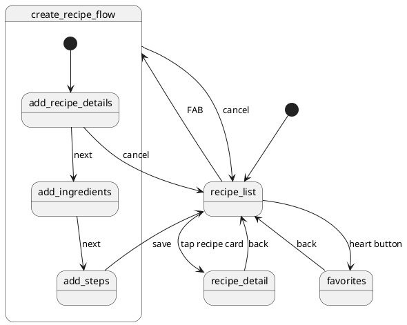

# Recipe App

## Navigation Graph

```plantuml
@startuml
[*] --> recipe_list

recipe_list --> favorites : heart button
recipe_list --> recipe_detail : tap recipe card

state "create_recipe_flow" as CreateFlow {
    [*] --> add_recipe_details
    add_recipe_details --> add_ingredients : next
    add_ingredients --> add_steps : next
}

recipe_list --> CreateFlow : FAB
add_recipe_details --> recipe_list : cancel
CreateFlow --> recipe_list : cancel
add_steps --> recipe_list : save

favorites --> recipe_list : back
recipe_detail --> recipe_list : back
@enduml
```

## Database Schema
